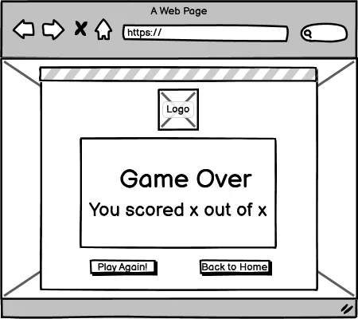
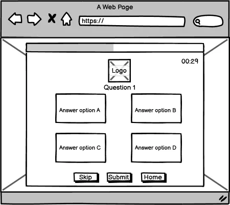
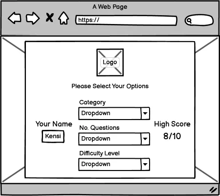
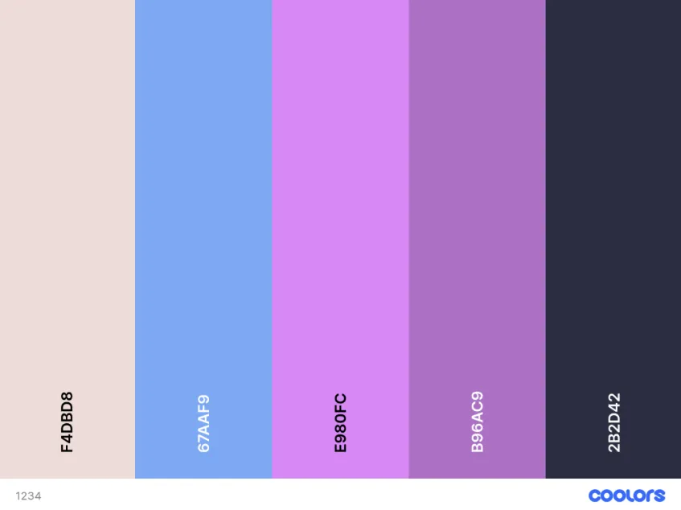
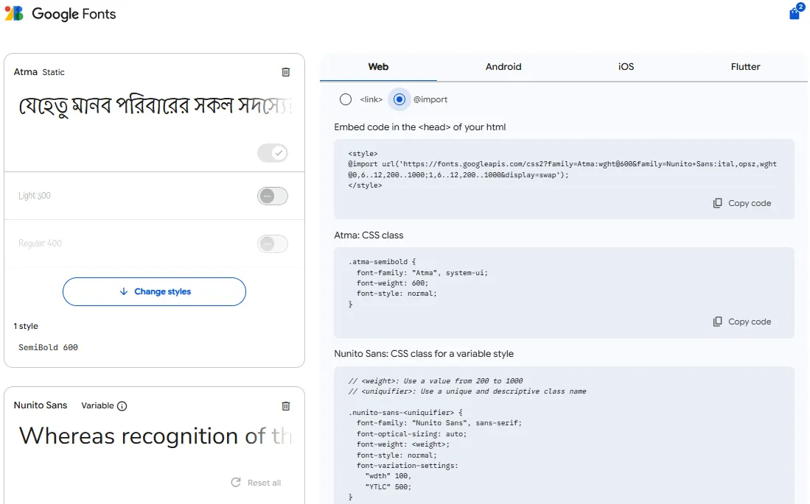
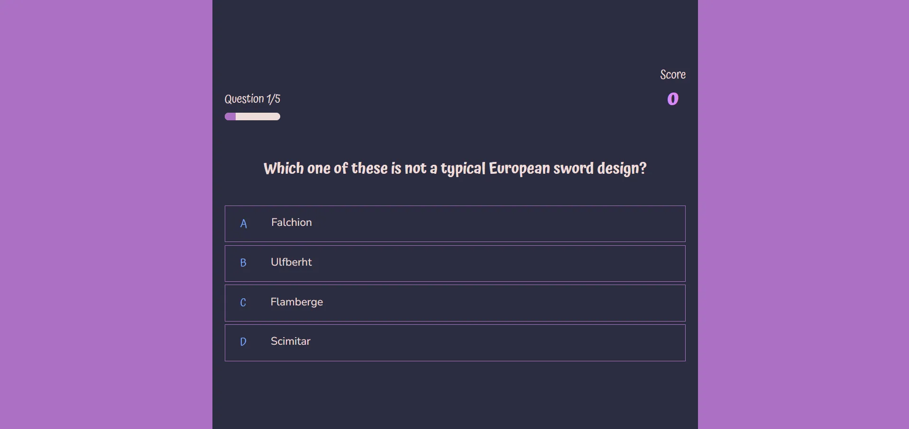
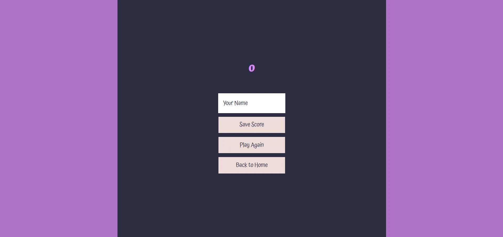
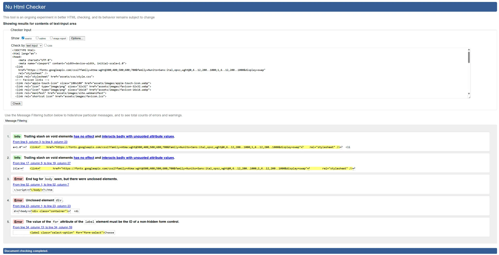
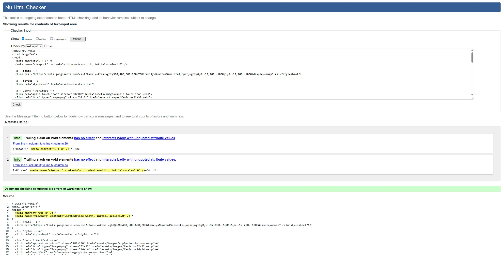

# Quiz Hawks 🦅  

Quiz Hawks is a fun and interactive quiz game built during our bootcamp hackathon.  
It allows players to test their knowledge, receive instant feedback, and track their scores through a user-friendly and fully responsive interface.  

👉 Live Site: [Quiz Hawks Deployed Link](https://danbaloiu.github.io/dev-hawks-quiz/)  
👉 Repository: [GitHub Repo](https://github.com/DanBaloiu/dev-hawks-quiz)  

---

## Table of Contents  
- [Project Overview](#project-overview)  
- [Features](#features)  
- [Technologies Used](#technologies-used)  
- [User Stories](#user-stories)  
- [Design and Wireframes](#design-and-wireframes)  
- [Screenshots](#screenshots)  
- [Validation--Testing](#validation--testing)  
- [AI Reflections](#ai-reflections)  
- [Credits](#credits)  
- [Future Improvements](#future-improvements)  

---

## Project Overview  

This project was created as part of the **AI Augmented FullStack Bootcamp Hackathon**.  
The goal was to design and implement a one-page interactive web application using **HTML, CSS, Bootstrap, and JavaScript**.  

The project focuses on:  
- Accessibility and responsive design.  
- Interactive DOM manipulation for real-time user feedback.  
- Clear structure and consistent UX.  
- Deployment and maintainability using GitHub Pages.  

---

## Features  
- ✅ Multiple-choice quiz with score tracking  
- ✅ Category selector (including randomised quiz option)  
- ✅ Loader animation before questions display  
- ✅ High scores stored locally in the browser  
- ✅ Responsive layout (mobile-first, Bootstrap grid system)  
- ✅ User-friendly navigation and consistent design  
- ✅ Results page summarising player performance  

---

## Technologies Used  
- **HTML5** – semantic structure & accessibility  
- **CSS3** – custom styling  
- **Bootstrap 5** – responsive layout and components  
- **JavaScript (ES6)** – DOM manipulation & interactivity  
- **Balsamiq** – used to create wireframes and plan UI design  
- **Git & GitHub** – version control and collaboration  

---

## User Stories  

### Must Haves  
- Responsive UI Across Devices  
- Multiple Choice Questions  
- Quiz Categories  
- Score & Results Screen  
- Loader Screen  

### Should Haves  
- Commute-Friendly Quiz (Selectable Length & Progress Bar)  
- Timer per Question  
- 404 Error Page  

### Could Haves  
- Answer Feedback (Show Correct/Incorrect After Each Question)  

📌 For full details on acceptance criteria and tasks, see our [Project Board](https://github.com/users/DanBaloiu/projects/6)  

---

## Design and Wireframes  

The quiz layout was designed with **simplicity and clarity** in mind.  
- A main question card with multiple-choice answers.  
- Score displayed dynamically.  
- Results page summarising outcomes.  

### Wireframes  

### Colour Palette  
We used a consistent and accessible colour palette to ensure clarity and good contrast across devices.  

 

**Hex codes:**  
- `#F4DBD8` (Light Pink)  
- `#67AAF9` (Sky Blue)  
- `#E980FC` (Bright Pink)  
- `#B96AC9` (Purple)  
- `#2B2D42` (Dark Navy) 

### Google Fonts
We chose Atma for its playful elegance and Nunito Sans for its clean readability—together they create a visually engaging and user-friendly experience that complements the spirit of our quiz app. We used Google Fonts to seamlessly integrate beautiful, high-performance typography—ensuring our quiz looks great across devices with minimal effort.

 

---

## Screenshots  

### Homepage / Quiz Screen  
 

### Results Page  

---

## Validation & Testing  

- ✅ HTML validated with [W3C Validator](https://validator.w3.org/)  
Index html validation before
 
Index html validation after
 
- ✅ CSS validated with [Jigsaw CSS Validator](https://jigsaw.w3.org/css-validator/)  
- ✅ JavaScript linted using ESLint – no major issues  
- ✅ Tested responsiveness across Chrome, Firefox, Safari, and Edge  
- ✅ Mobile responsiveness tested on multiple screen sizes  

---

## AI Reflections  

AI tools were used strategically to assist development:  
- **Code creation:** Supported in generating base functions for quiz logic.  
- **Debugging:** Helped identify merge conflict resolutions and JS logic errors.  
- **Performance & UX:** Suggested optimisations for responsiveness and accessibility.  
- **Workflow:** Improved team efficiency by clarifying tasks and speeding up problem-solving.  

We used AI as a **collaborative assistant**, not as a replacement for our coding. Every team member actively contributed to code, testing, and merging.  

---

## Credits  

👩‍💻 **Team Quiz Hawks**  
- Dan  
- Andrew  
- Kensi  
- Gilberto  

Special thanks to our **bootcamp facilitators** for guidance and support.  

### External Resources  
- [Bootstrap Documentation](https://getbootstrap.com/)  
- [MDN Web Docs](https://developer.mozilla.org/)  
- [Build A Quiz App With HTML, CSS and JavaScript – YouTube Tutorial](https://www.youtube.com/playlist?list=PLB6wlEeCDJ5Yyh6P2N6Q_9JijB6v4UejF)  
- [Build A Quiz App – GitHub Repository by James Q Quick](https://github.com/jamesqquick/Build-A-Quiz-App-With-HTML-CSS-and-JavaScript)  

### Data Licensing  
All data provided by the API is available under the [Creative Commons Attribution-ShareAlike 4.0 International License](https://creativecommons.org/licenses/by-sa/4.0/).  

## Future Improvements  

- Add multiplayer mode for competitive play  
- Introduce difficulty progression within categories  
- Implement sound effects and background music toggle  
- Add a leaderboard synced via an online database (not just local storage)  
- Provide accessibility features such as text-to-speech for questions  
- Create a dark mode / light mode theme toggle  

---

✅ This README covers **LO1–LO6 requirements**:  
- Clear UX/design explanation  
- Accessibility and responsive focus  
- Deployment instructions  
- Testing and validation evidence  
- AI reflection section  
- Screenshots and user stories  
- Colour palette documentation  
